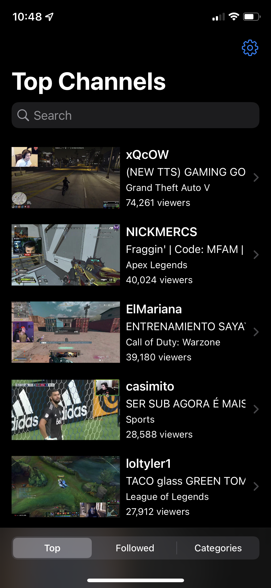
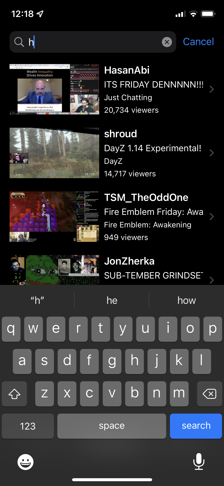
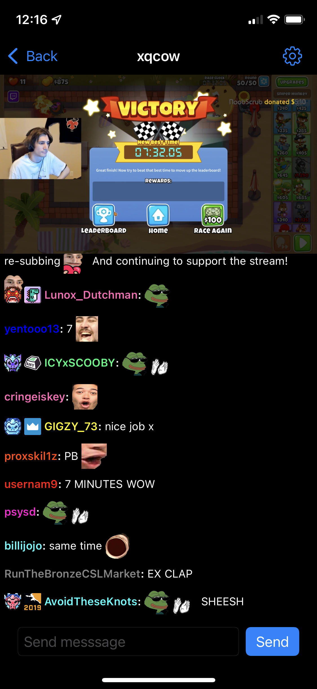

# Frosty for Twitch

**Note**: This app mainly served as a prototype and has been put on hold in favor of a new one built with Flutter. See it [here](https://github.com/tommyxchow/frosty), and if you're interested in why this decision was made, read below.

---

A Twitch client for iOS built with SwiftUI (and some UIKit).

## The Future of This App

Unfortunately, SwiftUI is currently not fit to support an effective Twitch chat. Until Apple releases performant layouts similar to span or flex wrap, this app won't be able to achieve a consistent chat.

This results in the following issues:

1. Inline GIF emotes with text are not supported (i.e. span).
2. GIF emotes don't sync.
3. Emotes aren't sized correctly on their first appearance.

These issues are likely fixable, but would lead to a workaround-rabbit-hole that I've already gone far enough into. This led me to look into other mobile frameworks with iOS support, specifically [React Native](https://reactnative.dev/) and [Flutter](https://flutter.dev/).

### React Native

While experimenting with React Native, issues 1 and 2 still existed. This was somewhat unsurprising as RN uses native components under the hood. As a result, the prototype was promptly scrapped.

### Flutter

While working with Flutter, it was clear that the team wanted to bring web-specific behaviors to mobile. Features like TextSpan/WidgetSpan, synced GIFs, height-only image sizing, and more are core features of the framework.

Since I was trying to emulate the web Twitch chat experience on iOS, it made perfect sense to take advantage of these features. Having the app work identically on Android through the Skia engine was a neat bonus too.

## Dependencies

- [Nuke](https://github.com/kean/Nuke) & [NukeUI](https://github.com/kean/NukeUI)
  - Thumbnail and emote caching.
- [FlexLayout](https://github.com/layoutBox/FlexLayout)
  - Lay out text and emote views with wrap and align.
- [KeychainAccess](https://github.com/kishikawakatsumi/KeychainAccess)
  - Store user tokens securely.
- [FLAnimatedImage](https://github.com/Flipboard/FLAnimatedImage)
  - Enable GIFs.
